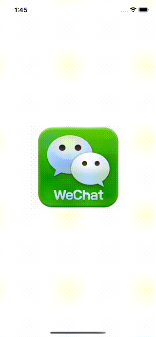

# WWSignInWith3rd+Wechat

[](https://developer.apple.com/swift/) [](https://developer.apple.com/swift/)  [](https://developer.apple.com/swift/) [](https://developer.apple.com/swift/)

[Use Wechat third-party login.](https://github.com/yanyin1986/WechatOpenSDK)

[使用微信的第三方登入。](https://developers.weixin.qq.com/doc/oplatform/Mobile_App/WeChat_Login/Development_Guide.html)



### [Installation with Swift Package Manager](https://medium.com/彼得潘的-swift-ios-app-開發問題解答集/使用-spm-安裝第三方套件-xcode-11-新功能-2c4ffcf85b4b)
```js
dependencies: [
    .package(url: "https://github.com/William-Weng/WWSignInWith3rd_Wechat.git", .upToNextMajor(from: "1.0.0"))
]
```

### Example
```swift
```
